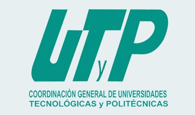
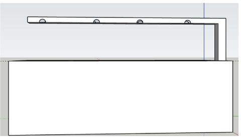
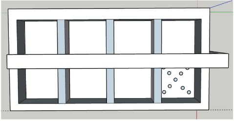
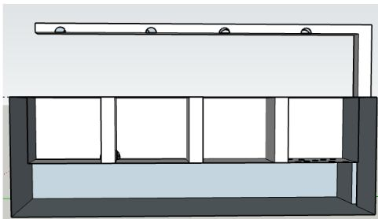
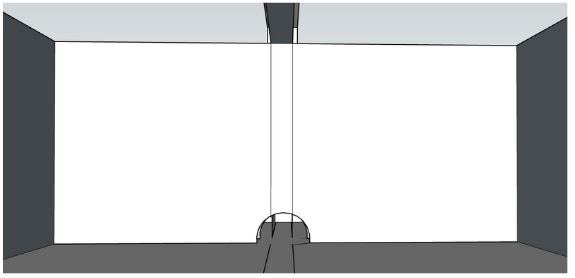
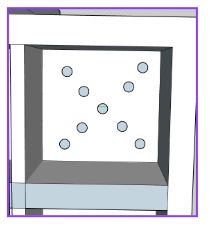

<blockquote>
<h2 style="text-align: center;">UNIVERSIDAD POLITECNICA DE VICTORIA</h2>

<strong>SEMILLERO INTELIGENTE</strong>

TESINA PARA OBTENER EL GRADO DE

<strong> INGENIERIA EN TECNOLOGIAS DE LA INFORMACION</strong>

PRESENTA

<strong>HECTOR ULISES AVENDAÑO REBOLLO</strong>

<strong>ALEX GUILLERMO CASTILLO NAVA</strong>

<strong>ESTEFANY SARAI HERNANDEZ VIDALES</strong>

<strong>CARLOS FRANCISCO MONARREZ CRUZ</strong>

<strong>JOSUE ELISEO PERALES MELENDEZ Y ALCOCER</strong>

<strong>MARTIN EDUARDO VAZQUEZ DIAZ</strong>

DIRECTOR

<h4 style="text-align: center;"><strong>DR. SAID P. MARTAGON</strong></h4>

ORGANISMO RECEPTOR

<strong>UNIVERSIDAD POLITECNICA DE VICTORIA</strong>

CIUDAD VICTORIA, TAMAULIPAS, DICIEMBRE DE 2022

</blockquote>

## Agradecimientos

## Resúmen

## Summary

## Semillero inteligente

### 1. Introducción

Cuando se asocian los temas de la tecnologia y la naturaleza se suele pensar que estos no pueden tener una convivencia sin afectarse mutuamente. Si bien esto llega a ser cierto en la mayoría de los casos, existen excepciones a esto. Con el avance tecnologico los impedimentos para que la convivencia entre naturaleza y tecnología
sea menor se han ido reduciendo.

En la actualidad existen proyectos que tratan de ayudar a la naturaleza. Por ejemplo, el proyecto Underwater Earth el cual es un proyecto hecho por una asociación sin fines de lucro para descubrir el oceando tomado fotografías y videos de un area de 360 grados del ocenado basandose en la frase "no se ama lo que no se sabe". Proyectos como este, son los que tratan de mejorar la convivencia tecnológica con la naturaleza.

Es bien conocido que la mayoría de los recursos los cuales los seres humanos usan es para su beneficio. Muchos de los alimentos consumidos, son dados de manera natural por el ambiente mediante semillas. Dichas semillas son otro ejemplo de como la tecnología puede ayudar a la naturaleza. Hoy en día, muchas semillas han sido mejoradas para que el producto de esta sea de mayor tamaño y mejor sabor, inclusive que estas puedan sobrevivir a ambientes más hostiles así como control de plagas.

Tomado como punto de partida el tema de las semillas, es donde comienza el proyecto, se sabe que existen una infinidad de semillas en la tierr. Cada una de estas requiere de diferentes características para su germinación, ya sea la humedad de la tierra, la luz de sol que recibe, o el tipo de riego. Todas y cada una de
estas características puede variar dependiendo el tipo de semilla que se utilice para la siembr. Siendo esto así, se es posible medir estas características y poder controlar la germinación de las semillas a lo que se requiera y esto puede ser logrado también implementando la tecnología a la naturaleza.

### 2. Marco Teórico

#### Visual Studio Code

Visual estudio Code es un editor de texto el cual permite desarrollar programas y sistemas en diferenetes lenguajes. Ademas de ser "Open Source" lo cual permite que sea uno de los preferedios por los programadores y quie tiene una comunidad muy activa. La razon principal para utilizar ese editor sobre cualquier otro son los "plugins". Para este proyecto, el plugin PlataformIO, permite desarrollar para la placa ESP32 DEV1 [1]

#### C/C++

C++ es un lenguaje multiplataforma que puede ser utilizado para crear aplicaciones de alto nivel. Es el lenguaje en el que esta construido Arduino el cual es utilizado por la placa ESP32 DEV1.

#### Python

Python es un lenguaje de programación que te permite trabajar de una manera rápida e integrar diferentes sistemas más efectivamente. La librería Serial, que es utilizada por arduino para monitorear datos de entrada y salida por las placas programables.

#### Arduino

Arduino es una plataforma "open-source" de electrónicos basada en fácil de utilizar hardware y software. La placa utilizada esta basada en Arduino. Por lo tanto, programada en el lenguaje c++ junto con la biblioteca estándar de Arduino y la biblioteca dht que se utiliza en el sensor de humedad y temperatura ambiental.

#### PlataformIO

Es un plugin que funciona como un IDE en visual studio code que permite la programación de diferentes placas principalmente basadas en Arduino, utilizado para compilar los códigos en la placa esp32

#### ESP32 DEV1

Es una placa de desarrollo basada en arduino, solo que más pequeña y especializada para IoT. Es la que se encarga de controlar los sensores para el semillero, como ya se ha descrito funciona con Arduino y será vital para el desarrollo del programa.

#### Semillero

De acuerdo a la rae, una de las definiciones de semillero, y la que realmente importa en este proyecto es "Sitio donde se siembran y crían los vegetales que después han de trasplantarse."

El semillero inteligente, se define como un semillero que de manera inteligente funciona por sí mismo, utilizando una placa programable, en este caso, esp32 en conjunto de diferentes sensores y otros circuitos, como:

- dht11 sebnsor de humedad y temperatura ambiental
- sensor de humedad del suelo
- bomba de agua

#### IOT (Internet de las cosas)

De acuerdo a Amazon, el término IoT, o Internet de las cosas, se refiere a la red colectiva de dispositivos conectados y a la tecnología que facilita la comunicación entre los dispositivos y la nube[7]. Claramente, al utilizar la placa ESP32 diseñada para hacer internet de las cosas, permite tener un monitoreo de la germinación de la semilla.

### 3. Justificación

En la modernidad la mayoría de las personas del ambito rural han migrado y siguen migrando a las ciudades grandes, lo que ha dejado descuidado el trabajo del campo en muchos lugares.

Gracias a la avance y la inovación tecnológica, es posible crear dispositivos automatizados que puedan controlar diferentes cosas.

Hoy en día, se cuenta con autos inteligentes, casas inteligentes, por mencionar algunos, que funcionan de manera autónoma con una configuración prestablecida por el usuario.
Es por esto que se ve en la necesidad de automatizar la actividad y producción rural. Ya se han utilizado drones para el monitoreo de sembradíos.

En México, la Industria de los invernaderos es bastante amplia y es necesario tener semilleros que permitan la germinación más optima de diferentes tipos de semillas, por esta razón, se ha establecido hacer un semillero inteligente.

### 4. Objetivos

El objetivo principal es realizar el semillero inteligente, y establece los siguientes requisitos:

- Proponer un prototipo 3D
- Realizar el circuito físico con un esp32
- Utilizar sensores de humedad
- Utilizar bomba de agua

El semillero solo debe ser utilizado para hacer germinar la semilla, en este caso se ha decidido por semilla de habanero. Despues de germinar debe ser removida.

### 5. Semillero Inteligente

Un semillero consiste de un área o lugar en el que se siembran semillas para lograr su germinación. Lo cual una vez que sucede, se procede a trasplantarlas en la zona en la que terminará su crecimiento.

Un semillero debe brindar las condiciones adecuadas a la semilla para poder tener un nacimiento adecuado, es decir, los niveles de temperatura, humedad y suelo se deben adaptar a la semilla que se desee germinar.

Los semilleros más comunes con los que nos podemos encontrar, son aquellos que constan de pequeños espacios o "celdas" en las que debemos introducir la tierra, los nutrientes y obviamente, las semillas, esto con la finalidad de que cada semilla cuente con el espacio necesario para ayudarla a nacer.

Con la llegada de los micro procesadores y sensores mucho más fáciles de implementar, es posible llevar a cabo proyectos que ayuden a mejorar o automatizar procesos que normalmente se realizarian manualmente.

#### Etapas en el proceso de germinación

##### **1. Fase de hidatración o de embibición**

La primera etapa, es la absorción del agua, por parte de la semilla. Sin esta etapa, el proceso de la germinación no puede darse. El proceso de hidratación de los tejidos de la semilla es un proceso físico de duración variable. La duración del mismo va a depender de la cantidad de agua disponible en el medio que rodea a la semilla y de la composición química de la semilla, lo cual va a influir en la permeabilidad de las cubiertas al agua y al oxígeno.

La entrada de agua en el interior de la semilla se debe a una diferencia de potencial hídrico entre la semilla y el medio ambiente que la rodea. Durante la fase de imbibición, el agua penetra en el interior de la semilla provocando el hinchamiento de la misma. Una vez que la semilla se ha hidratado, comienza a activarse una serie de procesos metabólicos que son esenciales para que se produzcan las siguientes etapas de la germinación.

Algunos de los factores que pueden influir en esta etapa de la germinación pueden ser:

- El déficit o exceso hídrico del medio que rodea a la semilla
- La velocidad de hidratación
- La temperatura a la que tiene lugar la imbibición.

##### 2. **Fase de germinación**

Una vez que la semilla ha completado la fase de hidratación, entra en la segunda fase del proceso de germinación. En esta, se van a producir una serie de reacciones metabólicas en el interior de la semilla, que van a dar como resultado la transformación de las macromoléculas de reserva, en moléculas solubles mucho más sencillas y asequibles para el embrión.

##### 3. Fase del crecimiento

Es la última fase del proceso de germinación de las semillas y se caracteriza por el aumento de la absorción de agua, así como por el aumento de la actividad respiratoria. La extensión de la radícula a través de las envolturas seminales es el hecho que supone la finalización de la fase de germinación propiamente dicha y marca el inicio de esta tercera y última fase del proceso de germinación.

Mientras que en las dos primeras fases de la germinación los procesos son reversibles, las semillas que alcanzan la fase de crecimiento no pueden volver a las etapas anteriores del proceso, es decir, entran en una situación fisiológica irreversible, y en el caso de que no se den las condiciones adecuadas para que esta fase pueda seguir adelante, la semilla morirá.

Una vez que la radícula rompe las cubiertas seminales, se inicia el desarrollo de la plántula, dando lugar a un proceso complejo, que implica un elevado gasto energético obtenido mediante la movilización de las reservas nutritivas de las semillas.

#### Definición del semillero

En este proyecto se desarrolla en un semillero inteligente a pequeña escala, constando de 3 semillas de habanero, con el fin de ser monitoreado y controlado mediante el uso de sistemas embebidos e Internet de las coas (IoT), los cuales se encargarán de recolectar información y procesar datos recolectados para poder ser visualizados. Asímismo, poder controlar varios factores que afectan al cultivo: la luz, agua, temperatura entre otros. Pretendiendo brindar al agricultor información en tiempo real sobre el estado del cultivo, ayudándole a tomar decisiones que permitan optimizar al máximo sus recursos para obtener mejores resultados, eliminando tareas que pueden ser repetitivas, que puede realizar un dispositivo.

#### Beneficios

* Monitoreo automático del estado actual de la planta.
* Registro de los resultados obtenidos.
* Automatización de procesos.

#### Alcances

Se puede adaptar a cualquier semilla siempre y cuando el tamaño de la celda sea el suficiente para su desarrollo.

Es una herramienta que puede ayudar a personas que no disponen del tiempo suficiente para dedicar a sus plantas.

#### Limitaciones

El semillero solamente servirá para germinar la semilla, después de terminar el proceso de crecimiento, es necesario conseguir una maceta o un terreno al que trasplantarla.

Puede adecuar condiciones como la humedad y la temperatura, pero el suelo y su calidad siguen dependiendo del usuario.

Si bien, cuenta con varias celdas para poder tener varias semillas a la vez, todas estas deberán ser del mismo tipo de planta.

#### Impacto en la sociedad

Gracias a la conectividad IoT, los sensores y las plataformas de gestión de Big Data se ha amplificado y conjuntamente con los invernaderos, que son una pieza fundamental en la agricultura, ayudando a solucionar el aumento a la producción de alimentos y automatización del tiempo.

El presente proyecto no tiene la estimación del tamaño de la empresa o la capacidad de inversión, por lo cual, los que hacen estas inversiones son las fincas o agricultores jóvenes con alguna formación agrícola, con explotaciones grandes y modernas, ya que para otros agricultores puede ser inviable.

Por otro lado, la tecnología verde es un campo que está en crecimiento para la innovación sostenible, donde pueden ejecutarse proyectos de jardines verticales o donde se puede replicarse jardines internos con plantas, puesto que ambos ejecutan una visión de la arquitectura sustentable, teniendo como resultado una vinculación con la naturaleza y el bienestar tanto físico como mental.

#### A quién se dirige el proyecto

El proyecto va dirigido a los invernaderos y a las casas que implementan la estructura de áreas verdes. Ya que los invernaderos que se destina a estabilizar el ambiente de crecimiento, amortiguando la temperatura ambiente y protegiendo a las plantas, tanto decorativas como hortícolas.

Asímismo, las viviendas verdes son una opción, ya que al ser un espacio habitual se genera bienestar integral, beneficiando al medioambiente, así como a la sociedad y la economía. Donde pueda cubrir las necesidades, fomentando la salud física, mental y espiritual de sus habitantes.

#### Proyectos similares

Durante los últimos cuarenta años se vienen utilizando en el mercado todo tipo de técnicas y productos para el tratamiento de los cultivos mediante diferentes fórmulas, de las cuales unas tienen un funcionamiento muy similar al de nuestro producto y otras tienen características y tecnologías muy diferentes a las utilizadas por los invernaderos.

Los que podrían ser considerados para lo invernaderos como una competencia directa, son todas aquellas empresas con productos que utilizan Una tecnología de punta, para su funcionamiento.

Debido a lo anteriormente expuesto, estas empresas no suponen un grave problema para el proyecto, ya que la credibilidad en el mercado es nula, sus ventas son ocasionales y muchos de ellos han desaparecido o se desconoce la continuidad en el mercado de nuestro país

Sin embargo, existen proyectos de universidades como los siguientes:

* Semilleros de Investigación en Sistemas Embebidos (Sise). El semillero ha desarrollado proyectos sobre IOT, la automatización, la realidad virtual, la agricultura digital y la domótica, con los cuales ha representado a la universidad EAFIT
* Smart Green: riego urbano inteligente a través del IoT y la inteligencia artificial proyecto descrito por Guillermo Mas Martines, Daniel Cardelús Vidal, consiste en el proceso de desarrollo y testeo de un nuevo sistema basado en las comuniciones IoT y la inteligencia artificial.

#### Visualización del proyecto

Al principio se tenia pensado realizar un semillero para 8 semillas. Posteriormente se decidió por reducirlo a 3, aquí se puede observar en el primer prototipo dibujado las 8 celdas

## Referencias

- [1] [https://code.visualstudio.com/](https://code.visualstudio.com/)
- [2] [https://www.w3schools.com/cpp/cpp_intro.asp](https://www.w3schools.com/cpp/cpp_intro.asp)
- [3] [https://www.python.org/](https://www.python.org/)
- [4] [https://www.arduino.cc/](%E2%80%B8https://www.arduino.cc/)
- [5] [https://www.circuitschools.com/what-is-esp32-how-it-works-and-what-you-can-do-with-esp32/](%E2%80%B8https://www.circuitschools.com/what-is-esp32-how-it-works-and-what-you-can-do-with-esp32/)
- [6] [https://dle.rae.es/semillero](https://dle.rae.es/semillero)
- [7] [https://aws.amazon.com/es/what-is/iot/](%E2%80%B8https://aws.amazon.com/es/what-is/iot/)
